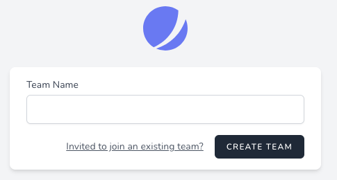
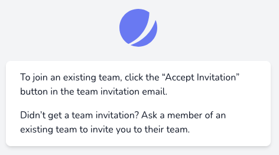

# BrilliantPortal

BrilliantPortal is an opinionated Laravel preset.

It provides starter team and user models, simplified team management, and basic API endpoints.

Out of the box, Jetstream assumes that every user will have a personal team and perhaps be invited to other teams. BrilliantPortal Framework removes the assumption that all users will have a personal team. See [usage](#usage) for more information.

BrilliantPortal Framework also installs a set of tests for features it provides.

## Installation

Install the package via composer with a custom repository.

1. Add this to your app’s `composer.json`:
```jsonc
{
    "repositories": [
        {
            "type": "composer",
            "url": "https://git.luminfire.net/api/v4/group/242/-/packages/composer/packages.json"
        }
    ],
    // etc.
}
```

1. Install the app:
```bash
# Require the framework.
composer require brilliant-portal/framework

# Run installation steps.
php artisan brilliant-portal-framework:install
# Available ptions:
# --stack=livewire|inertia (default livewire)
# --teams (default disabled)
# --api (default disabled)
```

You can publish the config file with:
```bash
php artisan vendor:publish --provider="BrilliantPortal\Framework\FrameworkServiceProvider" --tag="framework-config"
```

This is the contents of the published config file:

```php
return [

    'api' => [
        'version' => env('BPORTAL_FRAMEWORK_API_VERSION', 'v1'), // API versioning.
    ],

    'telescope' => [
        'prune' => [
            'hours' => env('TELESCOPE_PRUNE_HOURS', 48), // Prune entries older than this many hours.
        ],
    ],
];
```

## Customization

### Branding

To customize the branding, run this command and modify the new files in your application:

```shell
php artisan brilliant-portal:publish-branding
```

### BetterUptime

See https://betteruptime-laravel.brilliantpackages.com for documentation.

## Usage

### Teams

Add the `EnsureHasTeam` middleware to any routes that require a team. If the user does not have a team, they will be redirected to a screen prompting them to create a team.

```php
# Routes file in your app.
use BrilliantPortal\Framework\Http\Middleware\EnsureHasTeam;

Route::get('/team/settings/', function () {
    //
})->middleware(EnsureHasTeam::class);
```

An `EnsureHasNoTeam` middleware is also available if useful.

Screenshot of creating a new team:



Screenshot of message for joining an existing team:



### Users

BrilliantPortal Framework adds an `is_super_admin` column to the `users` table and model. By default, it is set to `false`.

Super-admins have privilges to do anything in the app, so use these permissions carefully.

## API

### Admin Endpoints

BrilliantPortal Framework provides endpoints for managing teams and users.

See `/dashboard/api-documentation` for details.

The admin endpoints require a super-admin or these explicit permissions (to use these, add them to your app’s `app/Providers/JetstreamServiceProvider.php` for the appropriate role(s)):

- `admin:create`
- `admin:read`
- `admin:update`
- `admin:delete`

### Generic Endpoints

BrilliantPortal Framework provides a generic endpoint for managing any model in the app other than teams and users.

See `/dashboard/api-documentation` for details.

This is intended for simple API integrations where it’s not worth the time to build a full set of endpoints and documentation. The `type` URL parameter indicates which model to use.

You should [create policies](https://laravel.com/docs/master/authorization#creating-policies) for each model and add them to your `app/Providers/AuthServiceProvider.php` file.

For ease of use, you can extend `BrilliantPortal\Framework\Policies\BasePolicy.php` and use `return $this->checkTeamOwnership($user, $model, $action);`. See `BrilliantPortal\Framework\User.php` for an example.

### Creating New Endpoints

You should [create policies](https://laravel.com/docs/master/authorization#creating-policies) for each model and add them to your `app/Providers/AuthServiceProvider.php` file.

For ease of use, you can extend `BrilliantPortal\Framework\Policies\BasePolicy.php` and use `return $this->checkTeamOwnership($user, $model, $action);`. See `BrilliantPortal\Framework\User.php` for an example.

Feel free to copy `BrilliantPortal\Framework\Http\Controllers\Api\Admin\User` and use it as a starting point for your custom API controllers. This extends `BrilliantPortal\Framework\Http\Controllers\Api\Controller`, which provides default authorization policy. It also provides example OpenAPI route annotations.

See `brilliant-portal/framework/src/OpenApi` for example OpenAPI request, response, and schema files, and https://vyuldashev.github.io/laravel-openapi for documentation.

You may also use or extend `BrilliantPortal\Framework\Http\Resources\DataWrapCollection` to wrap model index responses and `BrilliantPortal\Framework\Http\Resources\JsonResource` for single model responses.

## Testing

```bash
composer test
```

## Changelog

Please see [CHANGELOG](CHANGELOG.md) for more information on what has changed recently.

## License

The MIT License (MIT). Please see [License File](LICENSE.md) for more information.
