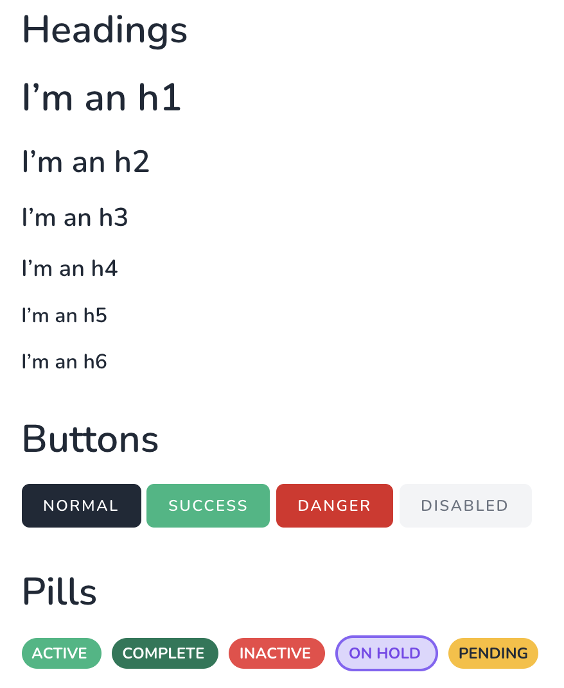

[TOC]

# BrilliantPortal

BrilliantPortal is an opinionated Laravel preset.

It provides starter team and user models, simplified team management, and basic API endpoints.

Out of the box, Jetstream assumes that every user will have a personal team and perhaps be invited to other teams. BrilliantPortal Framework removes the assumption that all users will have a personal team. See [usage](#usage) for more information.

BrilliantPortal Framework also installs a set of tests for features it provides.

## PHP Support Matrix

| PHP Version | Version |
|------------:|--------:|
|       > 8.0 |  1.x.x  |
|         7.4 |  0.1.x  |

## Installation

Install the package via composer with a custom repository.

1. Install the app:
```shell
# Require the framework.
composer require brilliant-portal/framework

# Run installation steps.
php artisan brilliant-portal:install
# Available options:
# --stack=livewire|inertia (default livewire)
# --teams (default disabled)
# --api (default disabled)
# --with-airdrop=true (default enabled)
```

You can publish the config file with:
```bash
php artisan vendor:publish --provider="BrilliantPortal\Framework\FrameworkServiceProvider" --tag="framework-config"
```

This is the contents of the published config file:

```php
return [

    'api' => [
        'version' => env('BPORTAL_FRAMEWORK_API_VERSION', 'v1'), // API versioning.
    ],

    'telescope' => [
        'prune' => [
            'hours' => env('TELESCOPE_PRUNE_HOURS', 48), // Prune entries older than this many hours.
        ],
    ],
];
```

## Updating

When updating BrilliantPortal Payments, you may wish to run `php artisan brilliant-portal-payments:install-tests` to install any updated tests into your app.

## Customization

### Branding

To customize the branding, run this command and modify the new files in your application:

```shell
php artisan brilliant-portal:publish-branding
```

### Views

To publish all views provided by BrilliantPortal Framework, run this command and modify the new files in your application:

```shell
php artisan vendor:publish --tag brilliant-portal-framework-views
```

### BetterUptime

See https://betteruptime-laravel.brilliantpackages.com for documentation.

## Usage

### Permissions

Add the `HasTeamPermission` middleware to routes that require a specific permission as defined in your `JetstreamServiceProvider`:

```php
# Routes file in your app.
use BrilliantPortal\Framework\Http\Middleware\HasTeamPermission;

Route::middleware(['auth:sanctum', HasTeamPermission::class.':create'])
    ->post(/* any endpoint where the user must have the `create` permission on their current team */);
```

### Teams

Add the `EnsureHasTeam` middleware to any routes that require a team. If the user does not have a team, they will be redirected to a screen prompting them to create a team.

```php
# Routes file in your app.
use BrilliantPortal\Framework\Http\Middleware\EnsureHasTeam;

Route::middleware(['auth:sanctum', EnsureHasTeam::class])
    ->get('/team/settings/', function () {
        //
    });
```

Screenshot of creating a new team:


Screenshot of message for joining an existing team:


### Users

#### Administrators

BrilliantPortal Framework adds an `is_super_admin` column to the `users` table and model. By default, it is set to `false`.

Super-admins have privileges to do **anything** in the app, so use these permissions carefully.

The `super-admin` capability can be used in authorization checks to determine if a user is a super-admin:

```php
if (Auth::user()->can('super-admin')) {
    // User is super-admin.
}
```

Add the `SuperAdmin` middleware to any routes that require super-admin access. If the user is not a super-admin, they will receive a `403 Forbidden` response.

```php
# Routes file in your app.
use BrilliantPortal\Framework\Http\Middleware\SuperAdmin;

# Using class name
Route::middleware(['auth:sanctum', SuperAdmin::class])
    ->get('/admin/dashboard/', function () {
        //
    });

# Using ability
Route::middleware(['auth:sanctum', 'can:super-admin'])
    ->get('/admin/dashboard/', function () {
        //
    });
```

#### Passwords

BrilliantPortal Framework sets some default password complexity requirements. See the [Laravel documentation](https://laravel.com/docs/8.x/validation#validating-passwords) for more information.

- Production environments: minimum 8 characters, mixed case, must not exist in known breaches
- Non-production environments: minimum 8 characters

#### Individual Name Fields

The `\BrilliantPortal\Framework\Traits\HasIndividualNameFields` trait may be used on a `User` model to indicate that the user table has distinct `first_name` and `last_name` fields rather than the standard `name` field that Laravel provides.

### Components

Several handy components are provided out of the box:

```blade
{{-- Headers --}}
<x-brilliant-portal-framework::h1>I’m an h1</x-brilliant-portal-framework::h1>
<x-brilliant-portal-framework::h2>I’m an h2</x-brilliant-portal-framework::h2>
<x-brilliant-portal-framework::h3>I’m an h3</x-brilliant-portal-framework::h3>
<x-brilliant-portal-framework::h4>I’m an h4</x-brilliant-portal-framework::h4>
<x-brilliant-portal-framework::h5>I’m an h5</x-brilliant-portal-framework::h5>
<x-brilliant-portal-framework::h6>I’m an h6</x-brilliant-portal-framework::h6>


{{-- Buttons --}}
<p class="mt-4">
    <x-brilliant-portal-framework::button-link href="#">normal</x-brilliant-portal-framework::button-link>
    <x-brilliant-portal-framework::button-link-success href="#">success</x-brilliant-portal-framework::button-link-success>
    <x-brilliant-portal-framework::button-link-danger href="#">danger</x-brilliant-portal-framework::button-link-danger>
    <x-brilliant-portal-framework::button-link-disabled href="#">disabled</x-brilliant-portal-framework::button-link-danger>
</p>

{{-- Pills (Hardcoded) --}}
<x-brilliant-portal-framework::pills.active>Active</x-brilliant-portal-framework::pills.active>
<x-brilliant-portal-framework::pills.complete>Complete</x-brilliant-portal-framework::pills.complete>
<x-brilliant-portal-framework::pills.inactive>Inactive</x-brilliant-portal-framework::pills.inactive>
<x-brilliant-portal-framework::pills.on-hold>On Hold</x-brilliant-portal-framework::pills.on-hold>
<x-brilliant-portal-framework::pills.pending>Pending</x-brilliant-portal-framework::pills.pending>


{{-- Pills (Dynamic) --}}
@php
    switch ($status) {
        case 'special':
            $pillSlug = 'something-else';
            break;

        default:
            $pillSlug = $status;
            break;
    }

    $pillName = 'brilliant-portal-framework::pills.'.$pillSlug;
@endphp
<x-dynamic-component :component="$pillName">
    {{ $status->label }}
</x-dynamic-component>
```

```php
// Pills (as a view).
return view('brilliant-portal-framework::components.pills.active', ['slot' => $value]);
```

Example screenshot:



To customize these, see [publishing views](#views).

## Search Engine Optimization

This package uses the [Spatie Laravel Robots Middleware package](https://github.com/spatie/laravel-robots-middleware) to prove `x-robots-tag` headers.

To use this, add the `\BrilliantPortal\Framework\Http\Middleware\RobotsMiddleware` class to your app’s `app/Http/Kernel.php` file under the `web` group.

You may use the `SEARCH_ENGINES_SHOULD_INDEX` and/or `SEARCH_ENGINES_BLOCK_PATTERNS` env variables to control access, or copy the `vendor/brilliant-portal/framework/src/Http/Middleware/RobotsMiddleware.php` file into your app and tweak the logic.

```conf
SEARCH_ENGINES_SHOULD_INDEX=false # by default, is true only in production environment
SEARCH_ENGINES_BLOCK_PATTERNS="login,two-factor.*,admin.*" # comma-separated string of route names; wildcards are supported
```

## API

### Admin Endpoints

BrilliantPortal Framework provides endpoints for managing teams and users.

See `/dashboard/api-documentation` for details.

The admin endpoints require a super-admin or these explicit permissions (to use these, add them to your app’s `app/Providers/JetstreamServiceProvider.php` for the appropriate role(s)):

- `admin:create`
- `admin:read`
- `admin:update`
- `admin:delete`

### Generic Endpoints

BrilliantPortal Framework provides a generic endpoint for managing any model in the app other than teams and users.

See `/dashboard/api-documentation` for details.

This is intended for simple API integrations where it’s not worth the time to build a full set of endpoints and documentation. The `type` URL parameter indicates which model to use.

You should [create policies](https://laravel.com/docs/master/authorization#creating-policies) for each model and add them to your `app/Providers/AuthServiceProvider.php` file.

For ease of use, you can extend `BrilliantPortal\Framework\Policies\BasePolicy.php` and use `return $this->checkTeamOwnership($user, $model, $action);`. See `BrilliantPortal\Framework\User.php` for an example.

### Creating New Endpoints

You should [create policies](https://laravel.com/docs/master/authorization#creating-policies) for each model and add them to your `app/Providers/AuthServiceProvider.php` file.

For ease of use, you can extend `BrilliantPortal\Framework\Policies\BasePolicy.php` and use `return $this->checkTeamOwnership($user, $model, $action);`. See `BrilliantPortal\Framework\User.php` for an example.

Feel free to copy `BrilliantPortal\Framework\Http\Controllers\Api\Admin\User` and use it as a starting point for your custom API controllers. This extends `BrilliantPortal\Framework\Http\Controllers\Api\Controller`, which provides default authorization policy. It also provides example OpenAPI route annotations.

See `brilliant-portal/framework/src/OpenApi` for example OpenAPI request, response, and schema files, and https://vyuldashev.github.io/laravel-openapi for documentation.

You may also use or extend `BrilliantPortal\Framework\Http\Resources\DataWrapCollection` to wrap model index responses and `BrilliantPortal\Framework\Http\Resources\JsonResource` for single model responses.

## Testing

```bash
composer test
```

## Changelog

Please see [CHANGELOG](CHANGELOG.md) for more information on what has changed recently.

## License

The MIT License (MIT). Please see [License File](LICENSE.md) for more information.
